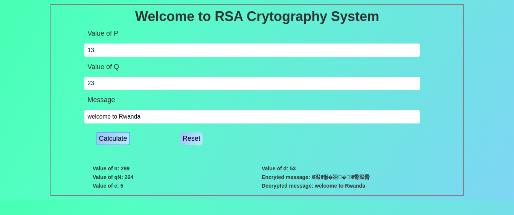

# RSA

RSA algorithm is asymmetric cryptography algorithm. Asymmetric actually means that it works on two different keys i.e. Public Key and Private Key. As the name describes that the Public Key is given to everyone and Private key is kept private.
# Screenshot

# Author 
  [NGIRIMANA Schadrack](https://github.com/ngirimana)
